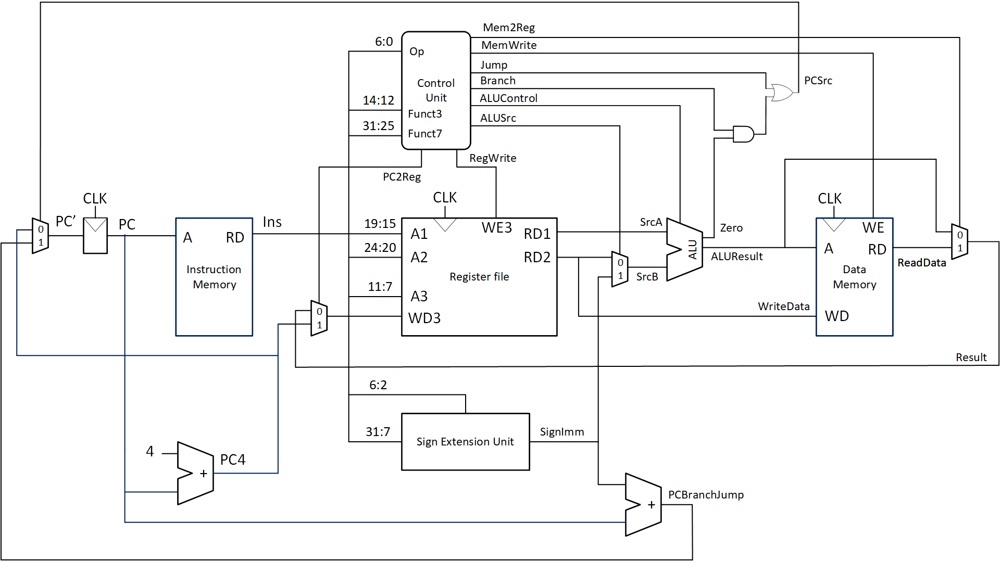
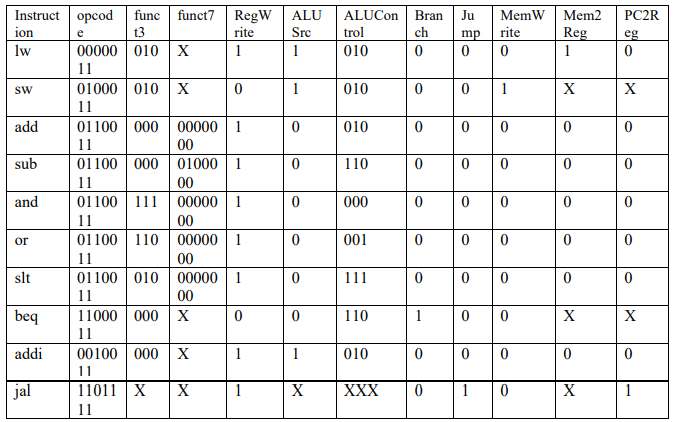
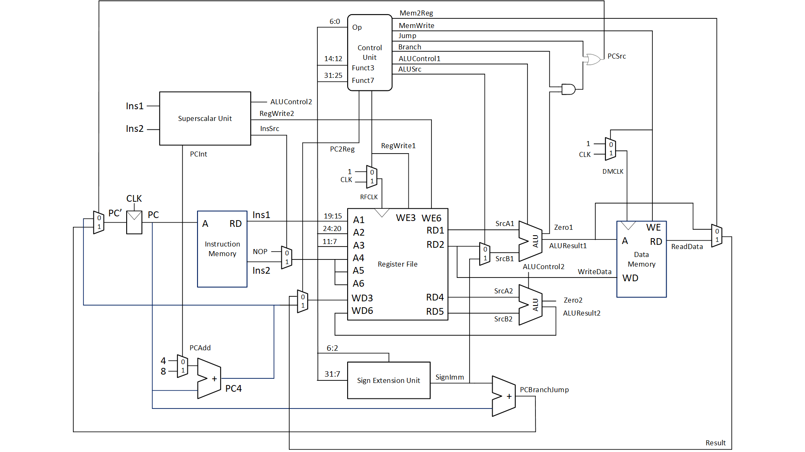
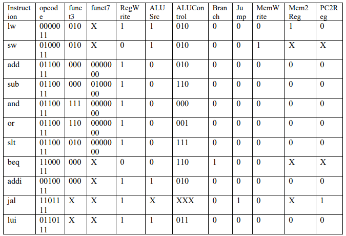

# Very simple RISC-V processor core that supports RV32I subset.
This is an undergraduate level project completed in March 2022.  
SystemVerilog is used. The design is verified using Quartus II and DE0-Nano FPGA board.  
### The version 1
It is a single-cycle core with simplest design. It can be a good example for education.  
The microarchitecture schematic:  
  
  
  
  
  
The controller truth table:  
  
  
  
  
  
### The version 2
The core is extended with a simple in-order superscalar unit. Switching gates for memories are added as well.  
The microarchitecture schematic:  
  
  
  
  
  
The controller truth table:  
  
  
  
  
  
### FPGA demo
This repo does not contain project files or setting files for the FPGA project.  
To run the demo, please replace the top level design and instructions (.txt), and add source files to the FPGA project you have created in Quartus or Vivado or any other tools.  
Instructions for the LED counter are loaded.  
If you are using DE0-Nano, please look at the pdf file in the demo folder.  
  
  
  
  
  
## References
[1] David Harris and Sarah Harris. 2012. Digital Design and Computer Architecture, Second Edition (2nd. ed.). Morgan Kaufmann Publishers Inc., San Francisco, CA, USA.  
[2]	David Patterson and Andrew Waterman. 2017. The RISC-V Reader: An Open Architecture Atlas (1st. ed.). Strawberry Canyon.  
